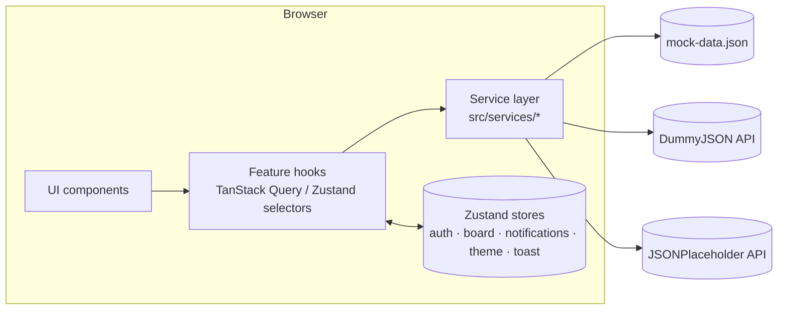
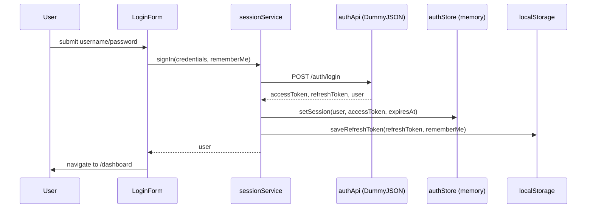
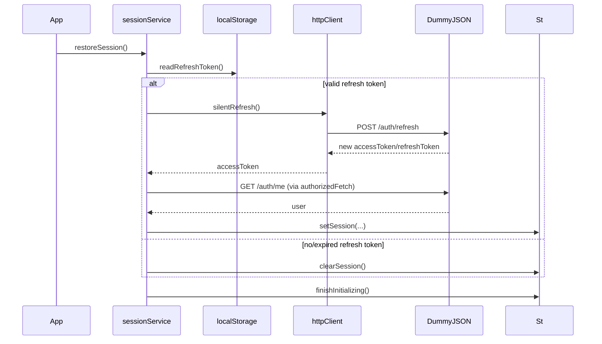
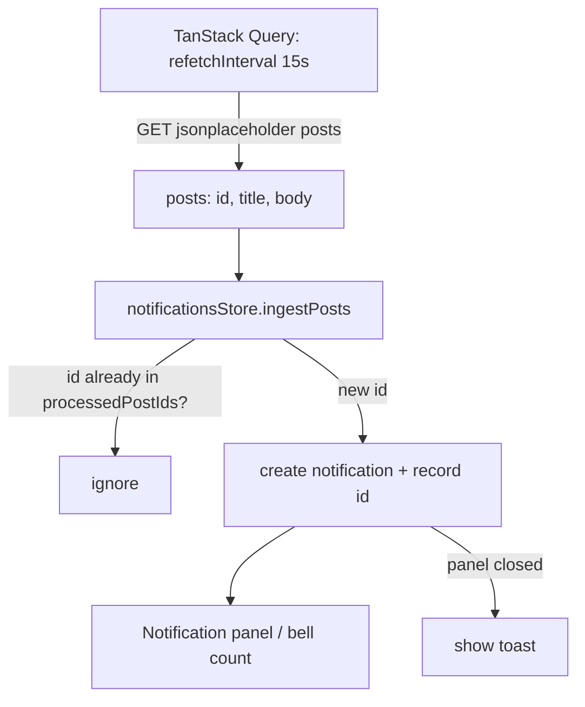

# Architecture

## 1. Overview

SprintDesk is a client-only single-page app. There is no application backend — three
external data sources stand in for one:

| Source | Used for |
|---|---|
| `mock-data.json` (served from `/public`) | Users, sprints, tasks, comments, seed notifications |
| DummyJSON (`dummyjson.com`) | Authentication (login, refresh, `/auth/me`) |
| JSONPlaceholder (`jsonplaceholder.typicode.com`) | Simulated notification polling |



No component ever calls `fetch()` or reads `mock-data.json` directly — every read goes
through `src/services/*`, and every piece of shared state goes through a Zustand store.
Swapping mock data for a real backend means changing the service layer only.

## 2. Folder structure

```
src/
  app/            router (React.lazy + Suspense route tree)
  components/
    ui/           design system (Button, Input, Select, Modal, Drawer, Toast, DataTable, ...)
    domain/       small app-specific presentational pieces (PriorityBadge, ChartCard, ...)
    layout/       shell chrome (Sidebar, Topbar, ThemeToggle)
  features/       one folder per domain area (auth, board, dashboard, analytics, notifications)
                  — each holds its components + any pure selector/helper functions
  hooks/          cross-cutting hooks (TanStack Query wrappers, useToast, useFocusTrap, ...)
  layouts/        AppShell (sidebar + topbar + outlet)
  lib/            framework-free utilities (date formatting, cn(), query client, sprint helpers)
  pages/          route-level components, lazy-loaded
  services/       the data-access layer, one subfolder per resource
  store/          Zustand stores
  styles/         Tailwind entry + CSS custom properties (theme tokens)
  tests/          Vitest + React Testing Library specs
  types/          shared TypeScript types
```

## 3. State management boundaries

| State | Owner | Why |
|---|---|---|
| DummyJSON login/refresh calls, notification polling | TanStack Query | Network requests — caching, retries, loading/error states, `refetchInterval` for polling |
| Auth session (access token, user, `isAuthenticated`, `isInitializing`) | Zustand (`authStore`, in-memory only) | Read by route guards and the HTTP interceptor outside of React |
| Board (tasks, comments) | Zustand (`boardStore`, persisted) | Mutated by many independent UI entry points (card, drawer, modal); persisted so edits survive a refresh |
| Notifications | Zustand (`notificationsStore`, persisted) | Same shape of problem — bell, panel, and the polling hook all read/write it |
| Theme | Zustand (`themeStore`, persisted) | Small, global, rarely-changing |
| Toasts | Zustand (`toastStore`, not persisted) | Global but ephemeral |
| Form inputs, drawer/modal open state, per-column "show more" counts | `useState` in the owning component | Never read outside that component's subtree |

Nothing here duplicates server state into Zustand, and nothing here uses React Context as
a substitute for the above — Context isn't used at all in this codebase.

## 4. Authentication flow



**Session restore on page load:**



While `isInitializing` is true, `ProtectedRoute`/`PublicOnlyRoute` render a full-screen
loader instead of redirecting — this avoids a flash of the login page for a user who is
actually still authenticated.

**The interceptor** (`src/services/http/httpClient.ts`) wraps every authenticated request:

1. Before sending, check whether the in-memory access token is missing or within 5s of its
   recorded expiry; if so, await a refresh first (proactive path).
2. Send the request with `Authorization: Bearer <token>`.
3. If the response is `401` anyway (reactive path — e.g. server-side clock skew), refresh
   once and retry the request once.
4. All refreshes — proactive or reactive, from however many concurrent callers — share one
   in-flight `Promise` (`refreshInFlight`), so a burst of requests around the same expiry
   moment triggers exactly one `/auth/refresh` call, not one per request.

## 5. Kanban state flow

`boardStore` holds a flat `Task[]`. Each task's `status` places it in a column; its `order`
(unique only within that status) places it inside the column. A single `moveWithinBoard`
helper backs `moveTask` (drag-and-drop), `updateTaskStatus` (the drawer's status dropdown),
and implicitly `deleteTask`/`addTask` (which re-index the affected column) — so there is one
code path for "a task's position changed," exercised by both mouse/keyboard drag and the
drawer's dropdown.

`@dnd-kit`'s `DndContext` lives in `BoardPage`. Each column is a droppable region (id =
status); each task is a sortable item. `onDragEnd` resolves the drop target — either
another task (insert before it) or empty column space (append) — and calls `moveTask` with
the resulting status/index.

## 6. Notification polling flow



TanStack Query's built-in focus manager already stops `refetchInterval` while
`document.visibilityState === 'hidden'` (`refetchIntervalInBackground` defaults to
`false`) and resumes it on visibility, so no separate `visibilitychange` listener exists in
this codebase.

## 7. Analytics data transformation

`src/features/analytics/analyticsSelectors.ts` contains pure functions
(`getVelocityData`, `getStatusDistribution`, `getPriorityBreakdown`, `getCompletionTrend`)
that derive chart-ready shapes from the live `tasks` array (and `sprints` for velocity).
`AnalyticsPage` re-runs them in a `useMemo` keyed on `tasks`/`sprints`, so any board mutation
(drag, create, delete, edit) is reflected on the next visit to `/analytics` — nothing is
cached or computed ahead of time.

## 8. Persistence strategy

| Store | Mechanism | Notes |
|---|---|---|
| `authStore` | none (memory only) | Access token must not survive a refresh |
| refresh token | `localStorage`, custom expiry | See Authentication section |
| `boardStore` | `zustand/persist` → `localStorage` | Seeded from mock data once via a `hydrated` flag |
| `notificationsStore` | `zustand/persist` → `localStorage` | Seeded once via a `seeded` flag; `processedPostIds` persisted for cross-session dedup |
| `themeStore` | `zustand/persist` → `localStorage` | — |

## 9. Error handling

- Network/service errors surface through TanStack Query's `isError`/`error` state (login
  form, board/notification bootstrap queries).
- `AuthApiError` carries the DummyJSON response status/message so the login form can show
  a specific message instead of a generic one.
- User-triggered mutations (create/update/delete task, add comment) are synchronous
  (Zustand) and always succeed locally; the toast system confirms the outcome.
- `react-router`'s data router renders a default error boundary for unhandled render
  errors; route-level `Suspense` boundaries cover the lazy-loaded pages.

## 10. Responsive strategy

Tailwind's default breakpoints (`sm`/`md`/`lg`) drive layout changes:

- **Sidebar**: a static column at `md+`; an overlay drawer triggered by a hamburger button
  below `md`.
- **Board**: columns lay out horizontally with scroll at `sm+`; they stack vertically below
  `sm` (375px) so nothing is clipped or hidden.
- **Drawer/Modal**: both are full-viewport-height, width-constrained panels that work down
  to 375px without horizontal scrolling.
- **Charts**: wrapped in Recharts' `ResponsiveContainer` inside a fixed-height card, so they
  reflow with the grid column width at every breakpoint.
